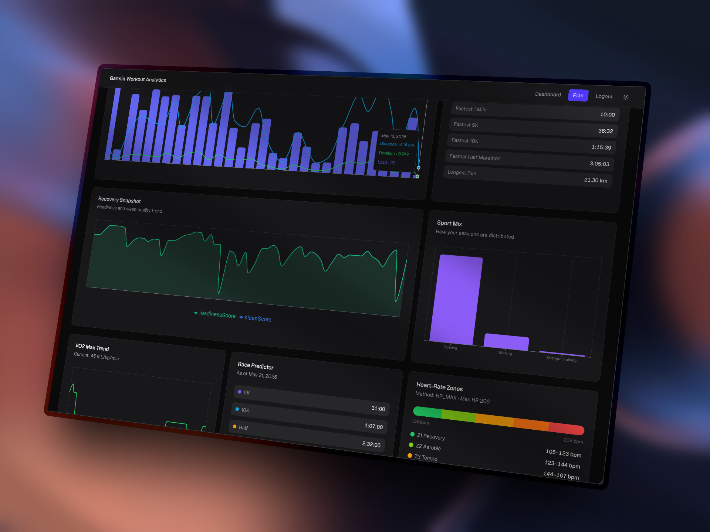

# WO Analysis — Garmin Workout Analytics & AI Training Planner

> **⚠️ Do It At Your Own Risk**
> This project is provided as-is. AI-generated training plans are suggestions only and do not replace professional coaching or medical advice. It may use your Garmin username and password to access Garmin services, so you should understand exactly what you are doing before signing in and only proceed if you are comfortable with the security and privacy implications. Always consult a qualified coach or physician before starting any training program. The authors accept no liability for injuries, overtraining, data loss, account restrictions, or any other harm resulting from use of this software.



A comprehensive Next.js application that ingests your Garmin DI Connect export (or syncs live from Garmin Connect), parses every metric into a unified analytics model, visualizes training trends, and generates periodized training plans powered by AI — with the ability to export workouts as `.fit` files and upload them directly to your Garmin account.

[](https://vercel.com/new/clone?repository-url=https%3A%2F%2Fgithub.com%2Fmgilangjanuar%2Fwo-plans&env=ANTHROPIC_API_KEY,MASTER_PASSWORD)
[](https://app.netlify.com/start/deploy?repository=https://github.com/mgilangjanuar/wo-plans)

## Features

### Dashboard (`/`)
- **Training load trends** — weekly volume (distance, duration, training load) with dual-axis charts
- **VO2 Max tracking** — running fitness capacity over time
- **Readiness & sleep** — merged readiness score and sleep quality area chart
- **ACWR (Acute:Chronic Workload Ratio)** — injury risk monitoring with status indicators
- **Race predictions** — 5K / 10K / Half Marathon / Marathon predicted finish times
- **Heart-rate zones** — 5-zone visualization with method, resting HR, and max HR
- **Power zones** — per-sport FTP and power zone breakdown
- **Sport distribution** — bar chart of session mix across all sports
- **Personal records** — current best efforts (time, distance, count)
- **Gear tracking** — equipment list with max usage distance
- **Personal insights** — auto-generated summary strings from your full history
- **Latest activities** — clickable list linking to detailed activity pages

### Activity Detail (`/activity/[id]`)
- Full session breakdown: distance, duration, pace, HR, power, training load, calories, steps, cadence
- **Split/lap charts** — pace, HR, power, cadence per split with Recharts
- **Training context** — current LTHR, FTP, and readiness signals alongside the activity
- **Related sessions** — 5 most recent activities in the same sport type

### AI Training Planner (`/plan`)
- **Free-text prompt interface** — describe your goal (e.g. "12-week marathon plan targeting 3:30")
- **Streaming responses** — real-time plan generation via Vercel AI SDK + Anthropic Claude
- **Periodized plans** — multi-phase training blocks with weekly templates
- **Save & manage plans** — persistent storage with title, prompt, and metadata
- **FIT file export** — downloads a `.zip` containing `.fit` workout files per phase/week
- **Direct Garmin upload** — pushes workouts to your Garmin Connect workout library via headless browser automation

### Authentication
- **Simple password gate** — HMAC-SHA256 signed cookie with timing-safe verification
- **Login page** (`/login`) — protects all routes behind a `MASTER_PASSWORD`

### Garmin Sync (Optional)

> **Live sync is entirely optional.** The app works perfectly with manual DI Connect JSON exports placed in `data/`. The live sync feature is a convenience that automates the export process — you can skip it entirely if you prefer.

- **Live sync from Garmin Connect** — automated browser-based data fetch via Playwright (requires `GARMIN_EMAIL` and `GARMIN_PASSWORD`)
- **16-step progress tracking** — real-time UI progress during sync
- **Anti-detection measures** — stealth plugin, webdriver masking, realistic user agent
- **2FA awareness** — detects and reports when manual login is needed
- **Fully replaceable** — drop a manual DI Connect export into `data/` instead; the parser reads the same format

## Tech Stack

| Category | Technology |
|---|---|
| Framework | Next.js 16 (App Router, Turbopack) |
| UI | React 19, Tailwind CSS 4, `@tailwindcss/typography` |
| Charts | Recharts 3 |
| AI | Vercel AI SDK 6 + Anthropic Claude Sonnet |
| Automation | Playwright Core + Puppeteer Extra (stealth) |
| FIT Encoding | `@garmin/fitsdk` |
| Packaging | JSZip |
| Validation | Zod 4 |
| Package Manager | pnpm |
| Linting | ESLint 9 + `eslint-config-next` |

## Getting Started

### Prerequisites

- [pnpm](https://pnpm.io/) 9.x
- Node.js 20+
- An Anthropic API key (for AI planner)
- Garmin DI Connect export (manual export recommended; live sync is optional and requires a local Chromium browser)

### Installation

```bash
git clone https://github.com/mgilangjanuar/wo-plans.git
cd wo-plans
pnpm install
pnpx playwright install
```

### Environment Setup

```bash
cp .env.example .env.local
```

Edit `.env.local`:

```env
ANTHROPIC_API_KEY=sk-ant-...
GARMIN_EMAIL=your@email.com
GARMIN_PASSWORD=your_password
MASTER_PASSWORD=your_secret_password
```

| Variable | Required | Description |
|---|---|---|
| `ANTHROPIC_API_KEY` | Yes (for `/plan`) | Anthropic API key for Claude Sonnet |
| `MASTER_PASSWORD` | Yes | Password to access the app (HMAC-signed session) |
| `GARMIN_EMAIL` | No (live sync only) | Garmin Connect account email — not needed if using manual export |
| `GARMIN_PASSWORD` | No (live sync only) | Garmin Connect account password — not needed if using manual export |

### Run Development Server

```bash
pnpm dev
```

Open [http://localhost:3000](http://localhost:3000). You'll be redirected to `/login` — enter your `MASTER_PASSWORD`.

### Production Build

```bash
pnpm run build
pnpm start
```

## Data Setup

The app reads Garmin data from the `data/` directory. You can populate it in two ways — both produce the same JSON format that the parser consumes.

### Option A: Manual DI Connect Export (Recommended)

This is the primary and most reliable method. It works everywhere (local, Vercel, Netlify, Docker) with no browser automation required.

1. Log in to [Garmin Connect](https://connect.garmin.com)
2. Go to **Account Settings → Download Your Data** (or use the DI Connect export tool)
3. Extract the downloaded archive
4. Copy the `DI-Connect-*` folders into your project's `data/` directory

The parser expects these subdirectories (standard Garmin export layout):

| Directory | Contents |
|---|---|
| `DI-Connect-Fitness/` | Summarized activities, workout library & schedule, personal records, gear |
| `DI-Connect-Metrics/` | Training history, acute load (ACWR), readiness, VO2 max, race predictions |
| `DI-Connect-Wellness/` | Sleep data, health status (HRV/stress), HR zones, power zones, bio metrics |
| `DI-Connect-User/` | User profile and settings |
| `DI-Connect-Device/` | Device backups |
| `DI-Connect-Aggregator/` | Hydration logs |
| `DI-Connect-Routing/` | Pace bands and courses |

### Option B: Live Sync (Optional — Produces Same Format as Option A)

> **Not required.** This feature automates the export process by logging into Garmin Connect and fetching data via its internal APIs. It writes the exact same JSON files to `data/` as Option A, so you can switch between the two at any time.

From the dashboard, use the **Sync from Garmin** button. The app will:

1. Launch a headless Chrome browser via Playwright
2. Log in to `connect.garmin.com` with your credentials
3. Fetch 16 data categories via Garmin's internal APIs
4. Write normalized JSON files to `data/` matching the DI Connect export format
5. Display real-time progress through each step

> **Note:** If your account uses 2FA, you'll be prompted to log in manually on Garmin Connect first. This feature requires a local Chromium installation and will not work on serverless platforms (Vercel, Netlify) without a custom runtime.

## How Garmin Data Is Parsed

The parser (`lib/garmin/parser.ts`) transforms raw Garmin JSON exports into a typed `WorkoutAnalytics` object through five layers:

### 1. File Reading Layer

14 JSON sources are read in parallel using three strategies:

| Strategy | Use Case |
|---|---|
| `readJsonFilesBySuffix(dir, suffix)` | Reads all files ending with a suffix (e.g. `_summarizedActivities.json`) |
| `readJsonFilesByPrefix(dir, prefix)` | Reads all files starting with a prefix (e.g. `TrainingHistory_`) |
| `readSingleJsonBySuffix(dir, suffix)` | Reads the single matching file (e.g. `_workout.json`) |

### 2. Extraction Layer

Raw files are arrays containing a single container object. The actual data lives inside nested keys:

- Activities: `raw[0].summarizedActivitiesExport[]`
- Workouts: `raw[0].workoutList[]` + `raw[0].workoutScheduleList[]`
- Metrics: flat arrays of daily records

### 3. Normalization Layer

Garmin uses non-standard units. The parser converts everything:

| Raw Garmin Unit | Normalized Unit | Conversion |
|---|---|---|
| Distance | centimeters → kilometers | `/ 100,000` |
| Duration | milliseconds → hours | `/ 3,600,000` |
| Speed | decimeters/sec → meters/sec | `× 10` |
| Pace | computed from speed | `1000 / (speedMps × 60)` min/km |
| Sleep | seconds → hours | `/ 3,600` |
| Race predictions | seconds → minutes | `/ 60` |
| Recovery time | minutes → hours | `/ 60` |
| Gear max distance | meters → kilometers | `/ 1,000` |

Split/lap data is parsed from the `measurements[]` array using `fieldEnum` keys (`SUM_DURATION`, `SUM_DISTANCE`, `WEIGHTED_MEAN_SPEED`, etc.). A scale correction is applied when split distances don't match the total activity distance.

Activities are deduplicated by `id-startTime` and sorted chronologically.

### 4. Aggregation Layer

- **Weekly volume** — bucketed by ISO week (Monday start)
- **Monthly volume** — bucketed by `YYYY-MM`
- **Sport distribution** — aggregated by sport type, sorted by duration
- **Totals** — activities count, distance, duration, calories, training load

### 5. Domain Parsers

| Parser | Source | Output |
|---|---|---|
| `parseTrainingHistory` | `TrainingHistory_*.json` | Daily training status & fitness trend |
| `parseAcuteLoad` | `MetricsAcuteTrainingLoad_*.json` | ACWR ratio, acute/chronic load |
| `parseReadiness` | `TrainingReadinessDTO_*.json` | Readiness score, recovery time |
| `parseVo2` | `MetricsMaxMetData_*.json` | VO2 max & max MET |
| `parseRacePredictions` | `RunRacePredictions_*.json` | 5K/10K/Half/Marathon predicted times |
| `parseSleep` | `*_sleepData.json` | Sleep score, duration, deep/REM/awake |
| `parseHealthStatus` | `*healthStatusData.json` | HRV & stress metrics |
| `parseWorkoutData` | `*_workout.json` | Workout library + scheduled plan |
| `parseThresholds` | `*_bioMetrics_latest.json` | Lactate threshold HR, FTP |
| `parseHeartRateZones` | `*_heartRateZones.json` | HR zone floors & method |
| `parsePowerZones` | `*_powerZones.json` | Per-sport FTP & power zones |
| `parsePersonalRecords` | `*_personalRecord.json` | PRs with type, value, date |
| `parseGear` | `*_gear.json` | Gear items with name, type, max km |

### Output: `WorkoutAnalytics`

The final object (`lib/garmin/types.ts`) contains:

| Field | Description |
|---|---|
| `period` | Date range and total days tracked |
| `totals` | Aggregate stats (activities, distance, duration, calories, training load) |
| `trends` | 9 time-series: weekly/monthly volume, readiness, acute load, VO2 max, race prediction, sleep, health, training status |
| `sportDistribution` | Breakdown by sport type |
| `activities` | Latest 15 + all activities with splits |
| `workouts` | Library count + scheduled items |
| `zones` | Heart rate & power zones |
| `thresholds` | Lactate threshold HR, FTP |
| `personalRecords` | All PRs with current/historical status |
| `gear` | Tracked equipment |
| `insights` | Auto-generated summary strings |

### AI Context

`buildAiWorkoutContext()` (`lib/garmin/ai-context.ts`) distills the full analytics into a compact context for the LLM: latest signals from each trend, 8 recent activities, thresholds, zones, and key insights. This is serialized to JSON and injected into the Claude prompt.

## FIT File Encoding & Garmin Upload

### FIT Encoding

Workouts are encoded as binary `.fit` files using the official `@garmin/fitsdk`. The encoder (`lib/garmin/fit-encoder.ts`) supports:

- **Workout steps** — warmup, active, cooldown, recovery, interval, rest
- **Duration types** — time-based, distance-based, or open (manual lap press)
- **Target types** — heart rate, cadence, power, speed, or open
- **Repeat blocks** — loop a sequence of steps N times (with proper FIT repeat control steps)
- **Multi-sport** — running, cycling, swimming, walking, generic

### Plan Export

When you export a plan from `/plan`:

1. Each phase and week is encoded as a `.fit` file
2. Files are named with sortable prefixes: `p01-base__w01-easy-run.fit`
3. All files are bundled into a `.zip` (compressed with DEFLATE)
4. The zip is stored as base64 in the plan JSON for later download

### Garmin Upload

The upload flow (`lib/garmin/session.ts`):

1. Launches headless Chrome with stealth anti-detection
2. Authenticates to Garmin Connect
3. Extracts CSRF token from page meta / request headers
4. POSTs each workout to the Garmin workout API with proper headers (`connect-csrf-token`, `nk`, `x-requested-with`)
5. Uploads in **reverse order** so Garmin's default "newest first" sort displays them correctly (w01, w02, w03...)
6. Includes a 1.1s delay between uploads to respect rate limits

## Project Structure

```
app/
  activity/[id]/page.tsx      — activity detail page with split charts
  api/
    auth/login/route.ts       — login endpoint (sets HMAC session cookie)
    auth/logout/route.ts      — logout endpoint (clears cookie)
    garmin/data/route.ts      — serves parsed analytics to client
    garmin/sync/route.ts      — live sync from Garmin Connect (SSE progress)
    garmin/upload/route.ts    — upload workouts to Garmin Connect
    plan/route.ts             — streaming AI plan generation
    plans/route.ts            — list/save plans
    plans/[id]/route.ts       — get/update/delete a specific plan
  login/
    layout.tsx                — login layout (no auth redirect)
    login-form.tsx            — login form component
    page.tsx                  — login page
  plan/page.tsx               — AI planner page
  page.tsx                    — dashboard page
  layout.tsx                  — root layout with auth guard
  globals.css                 — global styles + Tailwind

components/
  activity/
    activity-detail-charts.tsx — split/lap charts for activity detail
  dashboard/
    dashboard-client.tsx       — client-side dashboard wrapper
    garmin-sync-form.tsx       — live sync form with progress
    workout-dashboard.tsx      — main dashboard with all charts
  plan/
    plan-assistant.tsx         — streaming AI chat component
    plan-page-client.tsx       — planner page client wrapper
  ui/                          — shadcn-style UI primitives (badge, card, button, etc.)
  theme-provider.tsx           — next-themes provider
  theme-toggle.tsx             — dark/light mode toggle

lib/
  auth.ts                      — HMAC session auth (sign, verify, cookie)
  utils.ts                     — cn() utility (clsx + tailwind-merge)
  garmin/
    ai-context.ts              — AI context builder for LLM prompts
    api-fetcher.ts             — Garmin Connect API fetcher via Playwright
    dashboard-data.ts          — dashboard data aggregation helpers
    fit-encoder.ts             — FIT file encoder for workouts
    format.ts                  — display formatting (pace, distance, dates)
    parser.ts                  — core parsing engine (~800 lines)
    session.ts                 — Garmin workout upload via Playwright
    types.ts                   — TypeScript types (WorkoutAnalytics master type)
  plans/
    store.ts                   — plan persistence (save, list, update, delete)

data/                          — Garmin DI Connect export (gitignored)
public/                        — static assets
```

## API Routes

| Endpoint | Method | Description |
|---|---|---|
| `/api/auth/login` | POST | Authenticate with `MASTER_PASSWORD`, set session cookie |
| `/api/auth/logout` | POST | Clear session cookie |
| `/api/garmin/data` | GET | Return parsed `WorkoutAnalytics` as JSON |
| `/api/garmin/sync` | POST | Trigger live sync from Garmin Connect (SSE stream) |
| `/api/garmin/upload` | POST | Upload FIT workouts to Garmin Connect |
| `/api/plan` | POST | Stream AI-generated training plan (Claude Sonnet) |
| `/api/plan/export` | POST | Export plan as FIT zip (base64) |
| `/api/plans` | GET | List all saved plans (metadata only) |
| `/api/plans` | POST | Save a new plan |
| `/api/plans/[id]` | GET | Get a specific plan |
| `/api/plans/[id]` | PATCH | Update plan title |
| `/api/plans/[id]` | DELETE | Delete a plan |

## Development Conventions

- **Package manager**: always use `pnpm` (not npm/yarn/bun)
- **TypeScript**: strict mode enabled
- **Client components**: must have `"use client"` directive
- **Server components**: default (no directive needed)
- **No comments**: unless explicitly requested
- **UI components**: use existing components from `components/ui/`

### Common Commands

```bash
pnpm install          # install dependencies
pnpm add <pkg>        # add a dependency
pnpm add -d <pkg>     # add a dev dependency
pnpm dev              # start dev server (Turbopack)
pnpm run build        # production build
pnpm start            # start production server
pnpm run lint         # run ESLint
```

## Deployment

### One-Click Deploy

[](https://vercel.com/new/clone?repository-url=https%3A%2F%2Fgithub.com%2Fmgilangjanuar%2Fwo-plans&env=ANTHROPIC_API_KEY,MASTER_PASSWORD)
[](https://app.netlify.com/start/deploy?repository=https://github.com/mgilangjanuar/wo-plans)

### Vercel (Recommended)

```bash
vercel deploy
```

Set the following environment variables in your Vercel project settings:

- `ANTHROPIC_API_KEY`
- `MASTER_PASSWORD`

`GARMIN_EMAIL` and `GARMIN_PASSWORD` are not needed on Vercel — use manual DI Connect export (Option A) to populate `data/` instead.

> **Note:** Live Garmin sync and workout upload require a Chromium binary and cannot run on serverless platforms. For cloud deployments, use manual DI Connect export (Option A) to populate `data/`, and manually export/download FIT files from the planner.

### Netlify

1. Click the **Deploy to Netlify** button above, or connect your GitHub repo manually
2. In **Site settings → Environment variables**, add:
   - `ANTHROPIC_API_KEY`
   - `MASTER_PASSWORD`
3. Set the build command to `pnpm run build` and publish directory to `.next`
4. Deploy

`GARMIN_EMAIL` and `GARMIN_PASSWORD` are not needed on Netlify — use manual DI Connect export (Option A) to populate `data/` instead.

> **Note:** Netlify functions have a 10s timeout (Hobby) or 26s timeout (Pro). Garmin sync/upload use Playwright and will exceed these limits. Use manual DI Connect export (Option A) for cloud deployments.

### Docker

Create a `Dockerfile`:

```dockerfile
FROM node:20-alpine
WORKDIR /app
COPY package.json pnpm-lock.yaml ./
RUN corepack enable && pnpm install --frozen-lockfile
COPY . .
RUN pnpm run build
EXPOSE 3000
CMD ["pnpm", "start"]
```

## Privacy & Security

- **No external database** — all data is stored locally in `data/` as JSON files
- **Session auth** — HMAC-SHA256 signed cookies with timing-safe comparison
- **HttpOnly cookies** — session cookie cannot be accessed via JavaScript
- **Gitignored data** — `data/` directory is excluded from version control
- **No telemetry** — no analytics, tracking, or external data collection
- **API keys** — stored in `.env.local`, never committed

## License

MIT
